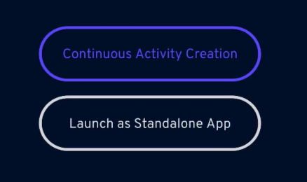

### History
- **[Updated Jun-14-2020]**:
  - Updated the data structure of the configuration file.
  - New integration interface 'IntegrationProxy', for launching AR. AR can be launched in multiple mode, such as 'single activity creation mode' and 'continuous activity creation mode'.
  - Removed interface 'SBContextManager', context info is integrated into the new interface for launching AR module.
  - Removed integration points for various kind of activity creation(e.g. PoI/Trivia/Photo/Video), because 'switching back and forth between native and Unity module' is going to be replaced by the new activity creation process, according to Jason's instruction. The new process is supported by the new interface 'IntegrationProxy' above.
  


--------------------------------------------

# About the 'framework':

### Which class is for what in general?

The original 'prototype' was very much built on top of the Placenote sample 'StickyNote', which is simple but not really extendable. As our UI, virtual content and related interaction would be much more complex later, we need an extenable frameork.


- **SocialBeeARMain** is the 'game manager'.

- **UIManager** is for managing all UI elemtns. All UI change should be done through UIManager instead of directly to the UI elements (e.g.panels, buttons, text). UIManager is the centrialized place where we can categorize UI elements and set the 'mode/state' of the whole UI. 

- **UIFacade** and many ***Facade** are for managing difference level of UI elements.
  
- **MessageManager** is for sending either notification messages(for end user) or debug messages(the 'console' in UI), or updating debug informations such as the feature-point number. All message update are through a queue(MainThreadTaskQueue) which is updated per-frame, so that it doesn't block the main thread.

- **AnchorManager** for managing all the anchor objects(one activity = one anchor) that created by the creator. This class mainly maintain the list of anchor but do not handle their status change or interaction. 

- AnchorManager should be managing the anchors only, if in future we allow users to create more virutal content in AR, we may need to create a **VirtualContentManager** seperately, and it may needs to be extended for various kinfdof activities, such as PoIContentManager, PhotoContentManager, VideoContentManager..., etc. 
  
- **AnchorController** is is extended from previous 'NoteController'(StickyNote sample), as we have a much more complex Anchor object now instead of the placenote 'note' object. This script is on every anchor obejct, responsible for controlling its status and handling the interaction. 

- **NavigationManager** to be implemented for navigation.


--------------------------------------------
# Naming convension

- Namespace: SocialBeeAR

- In case some code need to be modified from PlaceNote library or PlaceNote sample. please apply below naming comvension, so that it can be easily searched out, to be able to upgrade PlaceNote library easily in future.

```cs
//Commented off by Cliff Lin>>>>>>>>>>>>>>
//description...
//Session.start();
//<<<<<<<<<<<<<<<<<<<<<<<<<<<<<<<<<<<<<<<<
```

```cs
//Added off by Cliff Lin>>>>>>>>>>>>>>
//description...
Session.start();
//<<<<<<<<<<<<<<<<<<<<<<<<<<<<<<<<<<<<<<<<
```

```cs
//Modified by by Cliff Lin>>>>>>>>>>>>>>
//description...
Session.start();
//--------------original--------------
//Session.stop();
//<<<<<<<<<<<<<<<<<<<<<<<<<<<<<<<<<<<<<<
```


--------------------------------------------
# AnchorConfig (data to be stored in SB cloud)

**Note**: This is the configuration anchor data, which is currently stored in PlaceNote cloud, but can be easily switch to store in SocialBee server. 

This JSON-format configuration incldues the pose(position, rotation) of all the anchor objects(the 3D icon-shape object), as well as its context information(the related experience and activity collection). It also contains some activity specific data(**activitySpecific**), for example, the question/answer for Trivia activity.

Currently this configuration only include anchors. In case in future we will allow users to create more virutal content in the game, those content should have an related pose(position, rotation) to one of the anchors. That configuration can be extended or seperated from this configuration files.

###Sample
Please refer to './sbDataSample.json'
This is an [SB configuration data sample](sbDataSample.json "SB configuration data sample"). 

--------------------------------------------
#Interation Points

<!-- 
### Trivia Form
Calling the native UI for inputing Trivia question info in this method:
**TriviaContentFacade.cs**
```cs
public void EditTrivia()
{
    MessageManager.Instance.DebugMessage("Start editing trivia question.");

    // call native UI here...
    
}
```
There is a callback to be called after the editing
```cs
private void OnEditTriviaDone(TriviaQuestion triviaQuestion)
```


### Photo taking
**PhotoContentFacade.cs**
Calling the native UI for photo taking in this method
```cs
public void EditPhoto()
{
    MessageManager.Instance.DebugMessage("Start taking photo.");
    
    // UIManager.Instance.SetUIMode(UIManager.UIMode.PhotoTaking);
    // PhotoFacade.Instance.SetUIMode(PhotoFacade.UIMode.PhotoTaking);
    
    //call native UI for photo taking here...
}
```
There is a callback to be called after the editing
```cs
private void OnEditPhotoDone(string photoPath)
```


### Video taking
**VideoContentFacade.cs**
Calling the native UI for video taking in this method
```cs
public void EditVideo()
{
    MessageManager.Instance.DebugMessage("Start taking video.");
    
    //update content mode
    this.SetContentMode(ContentMode.Editing);
    
    //update UI mode
    UIManager.Instance.SetUIMode(UIManager.UIMode.VideoTaking);
    PhotoFacade.Instance.SetUIMode(PhotoFacade.UIMode.VideoTaking);
    
    //call native UI for video taking here...
}
```
There is a callback to be called after the editing
```cs
private void OnEditVideoDone(string videoPath)
{
    MessageManager.Instance.DebugMessage("Taking video done");
    
    //set the path of the video to be played
    // string filePath = "file://" + Application.streamingAssetsPath + "/" + "SeattleMuseum.mp4";
    // this.videoPath = filePath; //TODO: hard-coded, only for testing!
    
    //update content mode
    this.SetContentMode(ContentMode.PrePostEdit);
}
``` -->


## 1. Integration of the creator process


### 1.2 New interface: IntegrationProxy
**IntegrationProxy.cs** is the new interface to be called by native module, for launching AR.
The process of calling AR module for creator process:
- Step 1. Start Unity player from native module
- Step 2. Call StartContinuousActivityCreation() methods in 'IntegrationProxy.cs' to start the creator process.

- Two buttons from the entrance (if unity player is launched but the start* method is not called)
    - **Button 'Continuous Activity Creation'**: You can start 'continuous activity creation' mode, and you will create & place all activities in AR. You will automatically swtich back to native when the map is saved.

    - **Button 'Launch as Standalone App'**, this is the same as 'continuous activity creation' but won't automatically switch back to native after map is saved, until you exit AR by tapping 'Exit' button.
    


#### 1.2.1 For Continuous Activity Creation (all activities to be created in AR)
- Starting AR in 'Continuous Activity Creation' mode, all activities to be created in AR.
```cs
/// <summary>
/// This method to be called by native module to launch AR, to start creating activity continuously.
/// The first activity info is already specified from the native UI. 
/// </summary>
/// <param name="context">SocialBee context info</param>
public void StartContinuousActivityCreation(SBContext context)
```

- Callback when continuous activity creation is done successfully
```cs 
/// <summary>
/// Callback when continuous activity creation is done successfully
/// </summary>
public void OnContinuousActivityCreationSuccessful(string mapId, LocationInfo locationInfo)
{
    MessageManager.Instance.DebugMessage(string.Format("Continuous activity creation successfully, mapId: '{0}'", mapId));
    
    //switching back to native module here...
    
    //temporarily, switch to IntegrationScene
    UIManager.Instance.SetUIMode(UIManager.UIMode.Entrance);
}
```


- Callback when continuous activity creation is failed (e.g. failed when saving the Plcatenote map.)
```cs
/// <summary>
/// Callback when continuous activity creation is failed (e.g. failed when saving the Plcatenote map.)
/// </summary>
public void OnContinuousActivityCreationFailed(string mapId)
{
    MessageManager.Instance.DebugMessage(string.Format("Error: Continuous activity creation failed, mapId: '{0}'", mapId));
    
    //switching back to native module here...
    UIManager.Instance.SetUIMode(UIManager.UIMode.Entrance);
    
}
```


## 2. Integration of the consumer process (TO-BE-DONE)
So far it's not yet implemented. To test the created map, we can launch AR in either mode, and cancel the process, then search and load map from 'My Map' button in AR view.


## 3. Other integration points

<!-- ### Generation of Activity ID
Currently there is a method in **Utilities.cs** for  generating anchor ID(activity ID), and current implementation is just a draft. It should be aligned with the native app, it should call the native app to generate the activity ID.
```cs
/// <summary>
/// Generate activity Id
/// </summary>
/// <returns></returns>
public static string GenerateActivityId()
{
    //Todo: call the native method here
    return "" + new System.DateTimeOffset(System.DateTime.UtcNow).ToUnixTimeSeconds();
}
``` -->


### Switching back to native (temporary solution)
'SocialBeeARMain.cs'
Please add the integration code here to enable user switching back to the native app.
```cs
public void OnBackToNativeClick()
{
    //add integration code here... 
}
```
